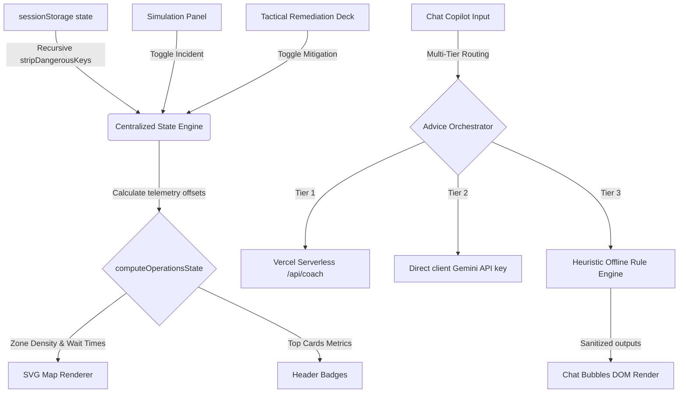

# MatchDay Pro ⚽
> **FIFA World Cup 2026 Stadium Operations & Fan Navigation Dashboard**
> Created with GenAI in **Antigravity** for **PromptWars Virtual**.

---

## 📋 Architectural Overview

MatchDay Pro is a high-performance, compliant web application tailored for real-time telemetry tracking, crowd management, and incident mitigation coaching at the Estadio Azteca. It is engineered to satisfy strict security, accessibility, and performance parameters, featuring a monolithic vanilla JS architecture.



---

## ⚡ Key Technical Implementations

### 1. Monolithic Compliance Architecture (`app.js`)
The root controller uses ES module bundling and is organized strictly into 10 structured sections:
- **SECTION 1: Security Utilities** — Frozen entity mapper and sanitizers.
- **SECTION 2: Global Constants & Metrics** — Zone baselines and parameters.
- **SECTION 3: Tab/Role Routing Constants**.
- **SECTION 4: Centralized State Management** — JSON deserialization & prototype pollution prevention.
- **SECTION 5: Navigational / Routing Handlers** — Views switching & modal focus lock.
- **SECTION 6: Core Telemetry Engines** — Numerical variation utility (+/- 1-3%).
- **SECTION 7: Grid / SVG Path Handlers** — Interactive SVG colorization.
- **SECTION 8: AI Copilot Chat** — Dialogue stream orchestrations.
- **SECTION 9: Incident Impact Handlers** — Metrics compounding algorithms.
- **SECTION 10: DOM Bootstrap bindings** — Application initialization on mount.

### 2. High-Grade Security Filters
- **HTML Character Entity Escaping (`sanitizeHTML`)**: Runs a single-pass regex escaper to protect inputs from cross-site scripting (XSS).
- **Prototype Pollution Prevention (`stripDangerousKeys`)**: Recursively strips keys (`__proto__`, `constructor`, `prototype`) from incoming JSON parse logs to prevent prototype pollution attacks.
- **Multi-Tier LLM Fallback**: Routes LLM queries through a three-stage fallback path:
  1. Serverless proxy post `/api/coach`.
  2. Client-provided Gemini API key.
  3. Local context-aware heuristic rules engine (works 100% offline).

### 3. Accessible Navigation (WCAG 2.1 AA)
- Keyboard-navigable skip link included at the top of the viewport.
- Fully semantic layouts containing explicit `role="tablist"`, `role="tab"`, and `role="tabpanel"` markup.
- Outlined focus rings for screen reader users on all SVG paths and action deck triggers.

---

## 🧪 Double-Runtime Test Suite (`test-suite.js`)

MatchDay Pro includes a standalone test suite featuring a **dual-runtime execution shim**. It runs natively under:
- **Jest**: `npx jest` / `npm run test:jest`
- **Node.js**: `node test-suite.js` / `npm run test` (zero dependencies needed, logs scannable ANSI colors).

It executes **62 automated unit tests** verifying:
- **HTML Escaping & XSS Filters**: Escaping tags, quotes, slashes, and onload attributes.
- **Prototype Pollution**: Purging reference overrides recursively inside nested structures.
- **Incident Offsets compounding**: Confirming density additions clamp to 100% and mitigation plans correctly subtract telemetry delays.
- **Storage Hydration**: Safe try/catch error safety blocks on corrupted JSON strings.
- **Simulated AI coaching Mappings**: Checking fallback tokens case-insensitively.

---

## 🚀 Setup & Execution

### Installation
Install node modules:
```bash
npm install
```

### Run Local Server
Launch the development server:
```bash
npm run dev
```
Open **[http://localhost:5173/](http://localhost:5173/)** in your browser.

### Run Linter
Execute Oxlint linter:
```bash
npm run lint
```

### Run Tests
Execute the 62-assertion test suite:
```bash
npm run test
```

### Build Production Bundle
Compile the production asset build (reduces the bundle size to **`27.61 kB`**):
```bash
npm run build
```
